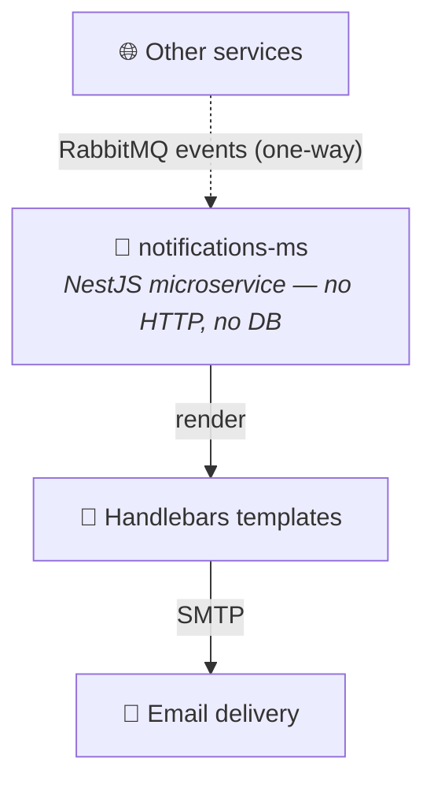

<h1 align="center">📧 Notifications Microservice · <code>notifications-ms</code></h1>

<p align="center">
  <b>NestJS microservice</b> that consumes RabbitMQ events and sends transactional emails<br/>
  through <b>SMTP</b> using <b>Handlebars</b> templates.
</p>

<p align="center">
  
  
  
  
  
</p>

<p align="center">
  
  
  
  
</p>

<br/>

## 📌 Purpose

`notifications-ms` is a **message-driven NestJS microservice** handling transactional email notifications across the platform. It consumes events from **RabbitMQ**, processes the payloads, renders dynamic templates with **Handlebars**, and sends emails through an SMTP provider.

**Main responsibilities:** 📩 password reset · ✉️ email verification · 🔄 email change notifications · 🏢 SaaS organization emails · 👤 customer emails.

| Characteristic | |
|---|:---:|
| RabbitMQ event consumer | ✅ |
| Handlebars-based templates | ✅ |
| SMTP provider agnostic | ✅ |
| Stateless service | ✅ |
| HTTP REST API | ❌ |
| Database dependency | ❌ |

<br/>

## 🏗️ Architecture



<br/>

## 🛠️ Tech Stack

| Technology | Purpose |
|---|---|
| **NestJS 11** | Microservice framework |
| `@nestjs/microservices` | RabbitMQ transport |
| **RabbitMQ** · `amqplib` · `amqp-connection-manager` | Event broker + connection management |
| `@nestjs-modules/mailer` · **Nodemailer** | Email module + SMTP delivery |
| **Handlebars** | Email template engine |
| **Zod** | Environment validation |
| `class-validator` · `class-transformer` | DTO validation / transformation |
| **Jest** | Testing framework |

<br/>

## 📦 Installation & Running

```bash
npm install
```

| Mode | Command |
|---|---|
| 🧑‍💻 Development | `npm run start:dev` |
| 🐞 Debug | `npm run start:debug` |
| 🚀 Production | `npm run build && npm run start:prod` |

> [!IMPORTANT]
> This service does **not** expose any REST API. It starts exclusively via `NestFactory.createMicroservice()` — no HTTP controllers, no REST endpoints, no `app.listen()`. The `PORT` env var is used only for startup logging (`Notifications Microservice is running on port XXXX`); it does not bind an HTTP server.

<br/>

## 🐳 Docker

The root `docker-compose.yml` runs this service with container port `4005`, `Dockerfile: EXPOSE 4005`, command `npm run start:dev`.

> [!NOTE]
> The exposed Docker port is **metadata only** — the service communicates exclusively through RabbitMQ and no HTTP traffic is expected.

<br/>

## 🧪 Testing

```bash
npm run test
npm run test:watch
npm run test:cov
npm run test:debug
npm run test:e2e
```

> [!WARNING]
> **Tests are not implemented yet** — no `*.spec.ts` files, no `test/` directory, no `jest-e2e.json`. The Jest scripts are currently scaffolding only.

<br/>

## 🔐 Environment Variables

Validated at startup using `src/config/envs.ts` — **the application fails during bootstrap if required variables are missing.**

| Variable | Required | Description |
|---|:---:|---|
| `NODE_ENV` | ✅ | Runtime environment (`development`, `production`, `test`) |
| `PORT` | ❌ | Startup log only |
| `RABBITMQ_URL` | ✅ | RabbitMQ connection URL |
| `RMQ_EVENTS_QUEUE` | ✅ | RabbitMQ queue name |
| `SMTP_HOST` | ✅ | SMTP server hostname |
| `SMTP_PORT` | ❌ | SMTP server port |
| `SMTP_USER` | ✅ | SMTP username |
| `SMTP_PASS` | ✅ | SMTP password |
| `SMTP_FROM` | ✅ | Default sender email |
| `LOGO_URL` | ✅ | SaaS email logo URL |
| `APP_NAME` | ✅ | SaaS application name |
| `APP_URL` | ✅ | SaaS application URL |

<details>
<summary><b>📄 Example <code>.env</code></b></summary>

<br/>

```env
NODE_ENV=development

RABBITMQ_URL=amqp://localhost:5672
RMQ_EVENTS_QUEUE=events.notifications

SMTP_HOST=smtp.example.com
SMTP_PORT=465
SMTP_USER=user@example.com
SMTP_PASS=password
SMTP_FROM=no-reply@example.com

LOGO_URL=https://example.com/logo.png
APP_NAME=My SaaS Platform
APP_URL=https://example.com
```

</details>

<br/>

## 📨 RabbitMQ Events

Transport `Transport.RMQ`, configured via `RABBITMQ_URL` + `RMQ_EVENTS_QUEUE`. The queue is `durable: true`. Events are consumed using `@EventPattern()` — these are **one-way events, no RPC response is expected**.

Patterns live in `src/custom-mailer/patterns/mailer_patterns.ts`; handlers in `src/custom-mailer/custom-mailer.controller.ts`.

| Event Pattern | Handler | Description |
|---|---|---|
| `forgot_password.saas` | `forgotPasswordSaaS` | SaaS password reset |
| `forgot_password.customer` | `forgotPasswordCustomer` | Customer password reset |
| `verify_email.saas` | `verifyEmailSaaS` | SaaS email verification |
| `verify_email.customer` | `verifyEmailCustomer` | Customer email verification |
| `saas_mailer_email_changed` | `requestEmailChangeSaaS` | SaaS email change |
| `customer_mailer_email_changed` | `requestEmailChangeCustomer` | Customer email change |

<br/>

## ✉️ Email Templates

Located in `src/custom-mailer/templates/`:

```
forgot-password-saas.hbs      forgot-password-customer.hbs
verify-email-saas.hbs         verify-email-customer.hbs
email-changed-saas.hbs        email-changed-customer.hbs
```

<details>
<summary><b>🧩 Template engine & resolution</b></summary>

<br/>

- **Engine:** rendered with `HandlebarsAdapter`, configured `strict: true` — missing template variables fail fast.
- **Resolution:** development → `src/custom-mailer/templates`; production → `dist/custom-mailer/templates`, selected via `process.env.NODE_ENV === "production"`.

</details>

<br/>

## 🔌 External Dependencies

| Dependency | Usage | Env |
|---|---|---|
| 🐇 **RabbitMQ** | Event consumption / queue subscription / message processing (required for startup) | `RABBITMQ_URL`, `RMQ_EVENTS_QUEUE` |
| 📨 **SMTP server** | Sending emails — any SMTP-compatible provider (Gmail, Mailgun, SendGrid, Amazon SES, custom…) | `SMTP_HOST`, `SMTP_PORT`, `SMTP_USER`, `SMTP_PASS`, `SMTP_FROM` |
| 🗄️ **Database** | Not used — no ORM, client, migrations, or DB env vars | — |

<br/>

## 📁 Project Structure

```
src/
├── config/
│   ├── envs.ts
│   └── transports/
├── custom-mailer/
│   ├── templates/
│   │   ├── forgot-password-saas.hbs
│   │   ├── verify-email-saas.hbs
│   │   └── email-changed-saas.hbs
│   ├── custom-mailer.controller.ts
│   ├── custom-mailer.service.ts
│   └── patterns/
│       └── mailer_patterns.ts
└── main.ts
```

<br/>

## 📝 TODO

> [!WARNING]
> Tracked openly and worth verifying before production.

- **Tests:** add unit, integration and e2e tests; create the Jest configuration.
- **Env example:** `.env.example` is missing `LOGO_URL`, `APP_NAME`, `APP_URL`, which are required by `src/config/envs.ts`.
- **Dependency cleanup:** `ioredis` is in `package.json` but has no imports or usage inside `src/` — possible leftover dependency.
- **RabbitMQ module cleanup:** `src/config/transports/rabbitmq.module.ts` contains commented code and is unused; the active RMQ config is implemented directly in `src/main.ts`.
- **Port configuration:** `PORT` does not represent an HTTP server (startup logs only); the Docker exposed port `4005` is not bound by any HTTP listener.

<br/>

## ✅ Service Status

| Feature | Status |
|---|:---:|
| RabbitMQ consumer | ✅ Implemented |
| SMTP email delivery | ✅ Implemented |
| Handlebars templates | ✅ Implemented |
| SaaS email templates | ✅ Implemented |
| Customer email templates | ✅ Implemented |
| Database | ❌ Not required |
| HTTP API | ❌ Not exposed |
| Automated tests | ⚠️ Pending |

<p align="center">
  
</p>